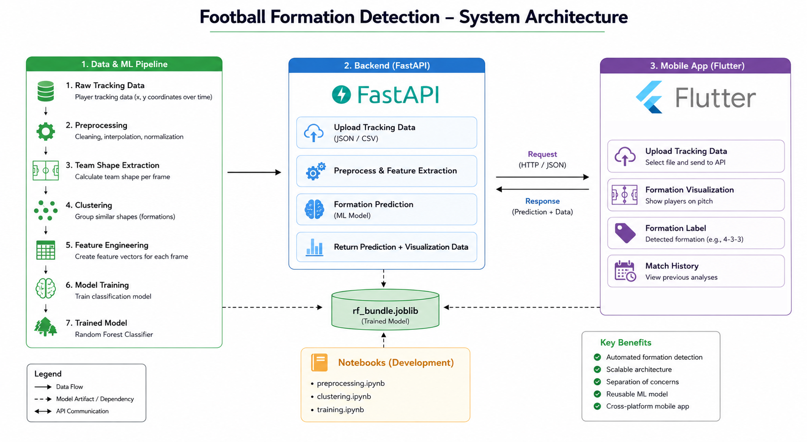

# Football Formation Detection

An end-to-end machine learning system for automatic football formation detection using player tracking data. The project combines data preprocessing, feature engineering, clustering, supervised learning, a REST API, and a Flutter mobile application for interactive visualization.

---

## Overview

Football formations are a fundamental component of tactical analysis. This project automatically identifies team formations from tracking data by extracting player positions, generating team shape features, and classifying formations using machine learning.

The system consists of:

* Data preprocessing pipeline
* Team shape extraction
* Feature engineering
* Formation clustering
* Machine learning classification
* FastAPI backend
* Flutter mobile application

---

## Features

* Automatic formation detection from tracking data
* Team shape visualization on a football pitch
* Match history and detected formations
* Machine learning-based classification
* REST API built with FastAPI
* Cross-platform Flutter application

---

## System Architecture

<p align="center">

</p>

---

## Application Preview

### Home Screen

<p align="center">

</p>

### Formation Visualization

<p align="center">

</p>

### Match History

<p align="center">

</p>

---

## Machine Learning Pipeline

The formation detection workflow consists of the following steps:

1. Import raw tracking data
2. Clean and preprocess player positions
3. Normalize coordinates
4. Extract team shapes
5. Cluster similar formations
6. Generate feature vectors
7. Train the classification model
8. Deploy the trained model through FastAPI
9. Predict formations from new tracking data
10. Display results in the Flutter application

---

## Project Structure

```text
football-formation-detection/
│
├── app/                  # Flutter mobile application
├── backend/              # FastAPI backend and trained model
├── notebooks/            # Data preprocessing and model training
├── model/                # Model documentation
├── data/                 # Dataset description (datasets not included)
├── images/               # Screenshots and architecture diagrams
│
├── README.md
├── LICENSE
└── requirements.txt
```

---

## Getting Started

### Clone the repository

```bash
git clone https://github.com/your-username/football-formation-detection.git

cd football-formation-detection
```

---

## Backend Installation

```bash
cd backend

pip install -r requirements.txt

uvicorn main:app --reload
```

The API will be available at

```
http://127.0.0.1:8000
```

Interactive API documentation:

```
http://127.0.0.1:8000/docs
```

---

## Flutter Application

```bash
cd app

flutter pub get

flutter run
```

---

## Jupyter Notebooks

The notebooks folder contains the complete machine learning workflow:

* **preprocessing.ipynb**

  * Data cleaning
  * Coordinate normalization
  * Player tracking preprocessing

* **clustering.ipynb**

  * Team shape extraction
  * Formation clustering
  * Tactical visualization

* **training.ipynb**

  * Feature engineering
  * Model training
  * Performance evaluation

---

## 📊 Technologies

### Programming Languages

* Python
* Dart

### Machine Learning

* Scikit-learn
* NumPy
* Pandas

### Backend

* FastAPI
* Uvicorn
* Joblib

### Mobile

* Flutter

### Data Visualization

* Matplotlib
* Plotly

---

## Dataset

The original tracking data is **not included** in this repository due to licensing and copyright restrictions.

Please refer to:

```
data/README.md
```

for additional information.

---


## Future Improvements

* Deep learning-based formation recognition
* Live match analysis
* Multi-match tactical comparison
* Automatic event detection
* Cloud deployment
* Model explainability

---

## License

This project is licensed under the MIT License.

---

## Author

**Mohsine Falih**

Master of Data Science

University of Applied Sciences Coburg

---

## Acknowledgements

This project was developed for educational, research, and portfolio purposes to demonstrate practical applications of machine learning, data science, backend development, and mobile application development in football analytics.
